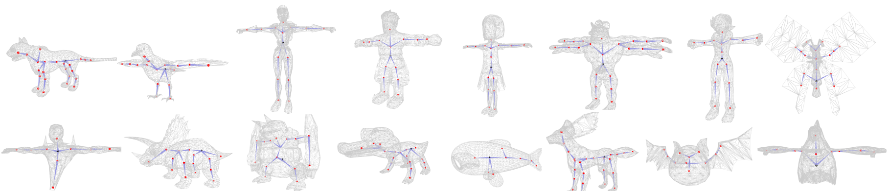

This is the code repository implementing the paper "RigNet: Neural Rigging for Articulated Characters".

**[2020.11.23]** There is now a great add-on for Blender based on our work, 
implemented by @[pKrime](https://github.com/pKrime). Please check the Github [link](https://github.com/pKrime/brignet), and the video [demo](https://www.youtube.com/watch?v=ueLlS3IoeGY&feature=youtu.be). 

## Dependecy and Setup

The project is developed on Ubuntu 16.04 with cuda10.0 and cudnn7.6.3. 
It has also been successfully tested on Windows 10.
On both platforms, we suggest to use conda virtual environment. 

#### For Linux user

**[2020.09.13]** I have tested the code on Ubuntu 20.04, with cuda 10.1 + cudnn 7.6. I installed (almost all) the dependencies as their latest versions and everything works fine. The following commands have been updated which install pytorch1.6.0 and pytorch_geometric1.6.1. 

```
conda create -n rignet python=3.7
conda activate rignet
```

Some necessary libraries include:

```
pip install numpy scipy matplotlib tensorboard open3d==0.9.0 opencv-python
pip install "rtree>=0.8,<0.9" 
pip install trimesh[easy]
conda install pytorch==1.6.0 torchvision==0.7.0 cudatoolkit=10.1 -c pytorch
pip install torch-scatter -f https://pytorch-geometric.com/whl/torch-1.6.0+cu101.html
pip install torch-sparse -f https://pytorch-geometric.com/whl/torch-1.6.0+cu101.html
pip install torch-cluster -f https://pytorch-geometric.com/whl/torch-1.6.0+cu101.html
pip install torch-spline-conv -f https://pytorch-geometric.com/whl/torch-1.6.0+cu101.html
pip install torch-geometric
```

#### For Windows user

The code has been tested on Windows 10 with cuda 10.1. The most important difference from Linux setup is, you need to download Windows-compiled Rtree from [here](https://www.lfd.uci.edu/~gohlke/pythonlibs/#rtree), and install it by
`pip install Rtree‑0.9.4‑cp37‑cp37m‑win_amd64.whl` (64-bit system) or 
`pip install Rtree‑0.9.4‑cp37‑cp37m‑win32.whl` (32-bit system). Other libraries can be installed in the same way as Linux setup instructions.


## Quick start
We provide a script for quick start. First download our trained models from [here](https://umass.box.com/s/l7dxfayrubf5qzxcyg7can715xnislwm). 
Put the checkpoints folder into the project folder. 

Check and run quick_start.py. We provide some examples in this script. 
Due to randomness, the results might be slightly different among each run. 
Generally you will get the results similar to the ones shown below:



If you want to try your own models, remember to simplify the meshes so that 
the remeshed ones have vertices between 1K to 5K. I use quadratic edge collapse in MeshLab for this. 
Please name the simplified meshed as *_remesh.obj.

The predicted rigs are saved as *_rig.txt. You can combine the OBJ file and *_rig.txt into FBX format by 
running maya_save_fbx.py provided by us in Maya using mayapy. (To use numpy in mayapy, download windows compiled numpy from [here](https://drive.google.com/drive/u/0/folders/0BwsYd1k8t0lEMjBCa2N1Z25KZXc) and put it in mayapy library folder. For example, mine is C:\Program Files\Autodesk\Maya2019\Python\Lib\site-packages)

## Data

Our dataset ModelsResource-RigNetv1 has 2,703 models. 
We split it into 80% for training (2,163‬ models), 10%
for validation (270 models), and 10% for testing. 
All models in fbx format can be downloaded [here](https://umass.box.com/s/448zm5iw1ewbq4l2kdll6q99v5y3q4pw).

To use this dataset in this project, pre-processing is performed. 
We put the pre-processed data [here](https://umass.box.com/s/9bo643jb2jy6tu9nffoe8zmad8dio0z5), which consists of several sub-folders.

* obj: all meshes in OBJ format.
* rig_info: we store the rigging information into a txt file. Each txt file has four blocks. (1) Lines starting with "joint" define a joint with its 3D position. Each of joint line has four elements, which are joint_name, X, Y, and Z. (2) Line starting with "root" defines the name of root joint. (3) Lines starting with "hier" define the hierarchy of skeleton. Each hierarchy line has two elements, which are parent joint name and its child joint name. One parent joint can have multiple children joints. (4) Lines starting with "skin" define the skinning weights. Each skinning line follows the format as vertex_id, bind_joint_name_1, bind_weight_1, bind_joint_name_2, bind_weight_2 ... The vertex_id follows the vertice order in obj files in the above obj folder.
* obj_remesh: This folder contains the obj files of the remeshed models. Meshes with fewer than 1K vertices were subdivided, and those with more than 5K vertices were simplified; as a result all training and test meshes contained between 1K and 5K vertices.
* rig_info_remesh: Rigging information files corresponding to the remeshed obj. Joints, hierarchy and root are the same. The skinning is recalculated based on nearest neighbor from each remeshed vertex to original vertices.
* pretrain_attention: Pre-calculated supervision to pretrin the attention module, which are calculated by the script geometric_proc/compute_pretrain_attn.py. Each file is a N-by-1 text where N is the number of vertices corresponding to remeshed OBJ file, the i-th row stores the surpervision for vertex i.  
* volumetric_geodesic: Pre-calculated volumetric geodesic distance between each vertex-bones pair. The algorithm is an approaximation, which is implemented in geometric_proc/compute_volumetric_geodesic.py. Each file is an N-by-B numpy array where N is the number of vertices corresponding to remeshed OBJ file, B is the number of bones, and (i, j) stores the volumetric geodesic distance between vertex i and bone j. 
* vox: voxelized models used for inside/outside check. Obtained with [binvox](https://www.patrickmin.com/binvox/). The resolution of the grid is 88x88x88.

After downloading the pre-processed data, one needs to create the data directly used for training/testing, please check and run our script: 

`python gen_dataset.py`

Remember to change the root_folder to the directory you uncompress the pre-processed data.

## Training

Notes: As new features, we have three improvements from the paper: (1) To train the joint prediction module, now we pretrain both the regression module and the attention module, and then fine-tune them together with differentiable clustering. (2) We optimized the hyper-parameters in the fine-tuning step. (3) the input feature for skinning now includes another dimension per bone (--Lf), indicating whether this bone is a virtual leaf bone or not. (To enable control from the end-joints, we presume a virtual bone for them. Please check the code for more details.)

1. Joint prediction: 

    1.1 Pretrain regression module:
    `python -u run_joint_pretrain.py --train_folder='DATASET_DIR/train/' --val_folder='DATASET_DIR/val/' --test_folder='DATASET_DIR/test/' --checkpoint='checkpoints/pretrain_jointnet' --logdir='logs/pretrain_jointnet' --train_batch=6 --test_batch=6 --lr 5e-4 --schedule 50 --arch='jointnet'`

    1.2 Pretrain attention module:
    `python -u run_joint_pretrain.py --train_folder='DATASET_DIR/train/' --val_folder='DATASET_DIR/val/' --test_folder='DATASET_DIR/test/' --checkpoint='checkpoints/pretrain_masknet' --logdir='logs/pretrain_masknet' --train_batch=6 --test_batch=6 --lr 1e-4 --schedule 50 --arch='masknet'`

    1.3 Finetune two modules with a clustering module:
    `python -u run_joint_finetune.py --train_folder='DATASET_DIR/train/' --val_folder='DATASET_DIR/val/' --test_folder='DATASET_DIR/test/' --checkpoint='checkpoints/gcn_meanshift' --logdir='logs/gcn_meanshift' --train_batch=1 --test_batch=1 --jointnet_lr=1e-6 --masknet_lr=1e-6 --bandwidth_lr=1e-6 --epoch=50`

2. Connectivity prediction

    2.1 BoneNet:
    `python -u run_pair_cls.py --train_folder='DATASET_DIR/train/' --val_folder='DATASET_DIR/val/' --test_folder='DATASET_DIR/test/' --checkpoint='checkpoints/bonenet' --logdir='logs/bonenet' --train_batch=6 --test_batch=6 --lr=1e-3`

    2.2 RootNet:
    `python -u run_root_cls.py --train_folder='DATASET_DIR/train/' --val_folder='DATASET_DIR/val/' --test_folder='DATASET_DIR/test/' --checkpoint='checkpoints/rootnet' --logdir='logs/rootnet' --train_batch=6 --test_batch=6 --lr=1e-3`

3. Skinning prediction:
    `python -u run_skinning.py --train_folder='DATASET_DIR/train/' --val_folder='DATASET_DIR/val/' --test_folder='DATASET_DIR/test/' --checkpoint='checkpoints/skinnet' --logdir='logs/skinnet' --train_batch=4 --test_batch=4 --lr=1e-4 --Dg --Lf`

##  License
This project is under dual-license. See the LICENSE README.txt file in this directory for complete text.
